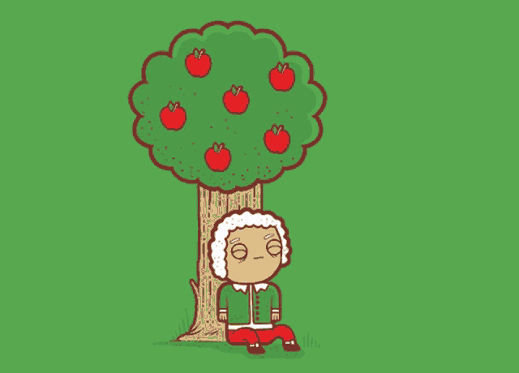

### <samp>&gt; Hi there, I'm <a href="https://vedantgrover.com" target="_blank">Vedant Grover</a>  </samp>

[](https://www.linkedin.com/in/vedant-grover-523825246/)
[](https://twitter.com/VedantGrover5)
[](https://instagram.com/vedantgrover06/)
[](https://vedantgrover.com)

### Glad to see you here! &nbsp; 

I am student who is aspiring to become a computer science engineer.

I love to swim, code, play the drums, and bike. I enjoy being outdoors (ironic huh?) and am a huge perfectionist. 

I also really want a dog 🐶

<!--  -->
  

**Talking about Personal Stuffs:**

- &nbsp;&nbsp; I’m currently working on a virtual assistant that makes my life easier;
- &nbsp;&nbsp; I’m currently learning C++ and Python.
- &nbsp;&nbsp; I love to work in groups and solve problems together.;
- &nbsp;&nbsp; Physics nerd at heart;
- &nbsp;&nbsp; How to reach me: bladedurman@gmail.com or through my website;

</br>

📊 **This Week I Spent My Time On:**
<!--START_SECTION:waka-->

```txt
TypeScript         11 hrs 25 mins  ██████████████████████░░░   88.46 %
JavaScript         24 mins         ▓░░░░░░░░░░░░░░░░░░░░░░░░   03.16 %
Ezhil              20 mins         ▓░░░░░░░░░░░░░░░░░░░░░░░░   02.61 %
YAML               17 mins         ▓░░░░░░░░░░░░░░░░░░░░░░░░   02.30 %
Markdown           9 mins          ▒░░░░░░░░░░░░░░░░░░░░░░░░   01.20 %
```

<!--END_SECTION:waka-->


📈 **My GitHub Stats:**

<p>
  
  
</p>


